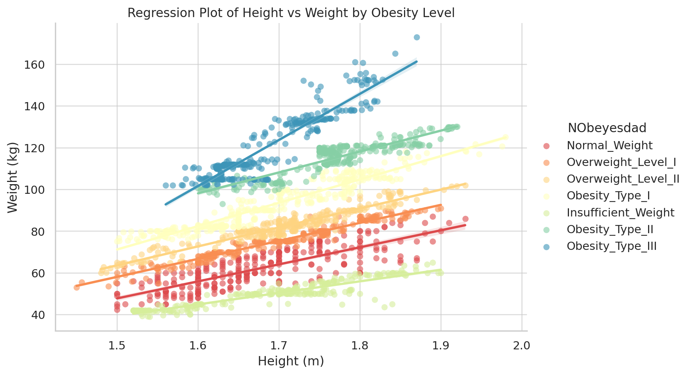

## **Data Science Institute - Cohort 5 - Team 3 Project**
# **Obesity Levels Based on Eating Habits and Physical Condition**

# **Team Members**
 
Bitewulign Mekonnen

Gulrukh Aqeel

Kate Antonova

Richard Harkness

Yalda Rahmati

# **Project Overview**

As part of the Data Science Certificate program at the University of Toronto’s Data Sciences Institute, we selected the Estimation of Obesity Levels Based on Eating Habits and Physical Condition dataset and conducted a compelling study on which lifestyle factors have the greatest impact on obesity levels, applying the analytical and technical skills we developed throughout the course.
This study offers practical advice for public health authorities, health and wellness providers, and insurers looking to address obesity-related risks.
This business case proposes using a validated dataset and analytical models to accurately estimate and predict obesity levels based on eating habits, physical conditions and other factors. 

# **Introduction**

Obesity is an escalating global health issue that significantly contributes to a range of chronic diseases, including heart disease, diabetes, and certain cancers. It is also associated with reduced life expectancy and leads to increased healthcare expenditures due to the need for long-term management of obesity-related conditions. Addressing this issue is crucial for improving public health outcomes and reducing the economic burden on healthcare systems.
This business case delves into the promising application of the dataset titled "Estimation of Obesity Levels Based on Eating Habits and Physical Condition." By utilizing this comprehensive dataset, we aim to develop sophisticated predictive models that can accurately estimate obesity levels based on individuals' eating habits and physical conditions. These models will provide valuable insights to inform public health strategies and initiatives.
With the integration of data analytics, we can enhance the effectiveness of public health campaigns by targeting specific populations at risk of obesity and tailoring interventions accordingly. Furthermore, this dataset can be leveraged to personalize health interventions, offering customized recommendations and support to individuals striving to achieve and maintain a healthy weight.
Our primary objective is to harness the power of data to improve the prediction and prevention of obesity. By doing so, we hope to foster a healthier society, extend life expectancy, and alleviate the financial strain on healthcare systems worldwide.

# **Problem Statement**
 
Obesity affects millions worldwide, raising healthcare costs, reducing productivity, and increasing the risk of chronic diseases like diabetes and heart disease. Traditional methods, like self-reports and BMI, often miss key factors. A data-driven approach that considers eating habits, physical activity, and lifestyle offers a clearer picture. Early identification of risks can help individuals and organizations take proactive steps to improve health outcomes.

# **Business Goal**

**The question is:**  What are the key lifestyle factors (e.g., eating habits, physical activity) that contribute most to obesity levels?

We aim to use data science to build a predictive model that estimates obesity levels based on eating habits and physical health. This kind of model can help healthcare providers, fitness companies, insurance firms, and policymakers take more targeted action when it comes to preventing obesity.

# **Expected Benefits**
 
It helps with the early detection of obesity risks, allowing for timely interventions that can reduce long-term healthcare costs. Insurance companies and corporate wellness programs can use it to categorize policyholders or employees by risk level, making health initiatives more targeted and effective. Healthcare providers can support preventive care and deliver personalized treatments, while governments and policymakers gain evidence-based insights to guide public health campaigns and shape policy. In the fitness and wellness space, it enhances personalized health plans, and for individuals, it provides valuable insights to make informed decisions about their health and lifestyle.

# **Data Science Approach**
 
The data science approach starts with collecting and cleaning the data to ensure accuracy, focusing on eating habits, physical activity, and demographic details. Next comes exploratory data analysis to uncover patterns and relationships between lifestyle factors and obesity levels. Data visualization techniques like histograms, scatter plots, and heat maps are used to make these insights clear and easy to understand. These visual tools help highlight trends, correlations, and outliers, providing a solid foundation for making informed decisions and developing targeted health strategies.

# **Model Objectives**

The key objectives presented by this model are as follows:

- Utilize machine learning models to predict obesity levels based on lifestyle and eating habits.

- Identify key risk factors contributing to obesity.

- Provide insight for insurance and healthcare professionals, policymakers and fitness industries.

- Develop an early warning system for individuals at a risk of obesity.

# **Methodology**
 
First, we implement data preprocessing to clean up and prepare the data that has no missing values, and duplicates. 
Data exploratory analysis will be implemented to  understand feature distributions and relationships with obesity levels
To visualize the relationship between different categorical features and obesity levels, we will develop an interactive dashboard using Dash and Plotly.  The dashboard development is implemented with a dropdown menu to allow users to select the specific feature and the category percentage distribution for all, and each category.  Thus, dynamic pie charts will be generated that display the distribution of obesity levels for each selected feature.
Feature selection is probably implemented to identify which features contribute the most to obesity. 
Classification: Machine learning models such as random forest, K nearest neighbours, others, and deep learning using CNN will be also implemented.

# **Requirements**

The following Python libraries are used in this project:

- **NumPy:** Fast matrix operations.

- **Pandas:** Analyzing and extracting insights from datasets.

- **Matplotlib:** Creating graphs and plots.

- **Seaborn:** Enhancing the style of matplotlib plots.

- **Scikit-learn:** Linear regression analysis.

# **Data Overview**

This dataset provides a comprehensive view of factors linked to obesity by combining demographic, behavioral, and health-related details. It captures key aspects such as age, gender, physical condition, and BMI classifications. It also tracks eating habits, including the consumption of high-calorie foods, vegetables, and alcohol, as well as meal frequency, snacking, water intake, and physical activity levels. This diverse range of attributes enables a detailed analysis of obesity-related factors.
Dataset Feature Description

The dataset provides information on individuals' obesity levels based on a variety of lifestyle and health-related factors. Below is a list of the features included, along with brief descriptions:
 
- **Gender:** Male or Female.

- **Age:** In years.

- **Height:** In meters.

- **Weight:** In kilograms.

- **Family_history_with_overweight:** Family history of being overweight (yes/no).

- **FAVC (Frequent Consumption of High-Calorie Food):** Frequently eats high-calorie food (yes/no).

- **FCVC (Frequency of Vegetable Consumption):** Scale from 1 (low) to 3 (high), indicating how often vegetables are consumed.

- **NCP (Number of Meals Per Day):** Number of main meals the person eats each day.

- **CAEC (Consumption of Food Between Meals):** How often the person eats snacks: no, sometimes, frequently, or always.

- **SMOKE:** Individual smokes (yes/no).

- **CH2O (Daily Water Intake in Liters):** Scale from 1 (low) to 3 (high), representing daily water consumption.

- **SCC (Calories Consumption Monitoring):** Individuals monitor their calorie intake (yes/no).

- **FAF (Physical Activity Frequency Per Week):** Scale from 0 (no activity) to 3 (high frequency).

- **TUE (Time Using Technology Devices Per Day):** Scale from 0 (low) to 2 (high), measuring daily screen time.

- **CALC (Alcohol Consumption Frequency):** How often alcohol is consumed: no, sometimes, frequently, or always.

- **MTRANS (Mode of Transportation):** Main mode of transport: public transportation, walking, automobile, or motorbike.

- **NObeyesdad (Obesity Level Classification):** The individual's obesity category: Insufficient Weight, Normal Weight, Overweight Level I, Overweight Level II, Obesity Type I, Obesity Type II, or Obesity Type III.

# **Cleaning the Data**

The original dataset is of good quality with no missing values. However, it contains 24 duplicate rows, likely from synthetic generation (77% via Weka and SMOTE). We removed these duplicates, retaining unique entries, to improve reliability while preserving completeness.

# **Proposed Solution**
 
The proposed solution uses the “Dataset for estimation of obesity levels based on eating habits and physical condition” to include visualizations to highlight the key factors that contribute most to obesity and develop a predictive model that classifies individuals into seven obesity levels. The process begins with data cleaning and preprocessing, followed by identifying key factors such as diet quality, hydration, physical activity, sedentary behavior, and transport choices. The final step is creating an interactive tool or dashboard that delivers personalized health recommendations, targeted interventions, and easy monitoring for healthcare providers, fitness professionals, insurance companies, and policymakers.

# **Insights and Visualizations**

## Regression Plot for Height vs Weight by Obesity Level

The Regression Plot for Height vs. Weight is color-coded by Obesity Level. This plot shows the relationship between height and weight, with trend lines for each obesity category. It highlights how weight increases in relation to height and how it differs across obesity levels.

Proposed sections for Charts, Graphs and Plots

# **Implementation**
 
The implementation starts with applying data analytics techniques to the dataset to build an accurate and reliable model. Once the model is ready, the next step is to make it easy for health professionals and organizations to assess and manage obesity risk. The goal is to keep it simple and intuitive so users can quickly get the insights they need.

# **Next Steps**
 
The next steps start with running exploratory data analysis to get a better understanding of how different variables are connected. After that, the focus will be on training and validating the predictive models to make sure they’re accurate and reliable. Once the model is solid. The plan is to provide stakeholders, including health professionals and the public, with clear insights and visualizations through a comprehensive README on GitHub. This will include key information, data interpretations, and graphs to help them better understand and address obesity risks.

# **Risks and Mitigations**
 
There are a few risks to consider, but each has a clear plan to address them. First is data quality, if the data is incomplete or inaccurate, it can lead to unreliable results. To avoid this, the data will go through rigorous cleaning and validation to ensure it’s consistent and accurate before analysis. Another risk is bias in the analysis, which can happen if the dataset isn’t diverse enough. To minimize this, the data will be carefully reviewed to make sure it includes a wide range of demographic and lifestyle factors, helping to produce fair and balanced insights. Privacy is also a major concern, especially when dealing with health-related data. To protect personal information, the project will follow strict data protection regulations and best practices, ensuring all data remains confidential and secure throughout the process.

# **Results**

The model aims to create a positive impact and raise awareness across several key sectors. In healthcare, it supports preventive measures and enables more targeted interventions. For governments and policymakers, it offers evidence-based insights to guide public health initiatives and inform policy decisions. Individuals also benefit by gaining valuable knowledge that empowers them to make informed lifestyle choices and take control of their health.

# **Conclusion**

By using this dataset to estimate obesity levels, we can support smarter, data-driven decisions in healthcare, wellness, insurance, and public policy. The insights gained from the analysis not only have the potential to lower obesity rates but also to reduce long-term healthcare costs and improve overall productivity. Clear visualizations and accessible information empower stakeholders, from healthcare providers and insurance professionals to policymakers and individuals, to take proactive steps toward prevention and intervention. Ultimately, this approach promotes healthier lifestyles, supports early risk detection, and contributes to better public health outcomes on a larger scale.
