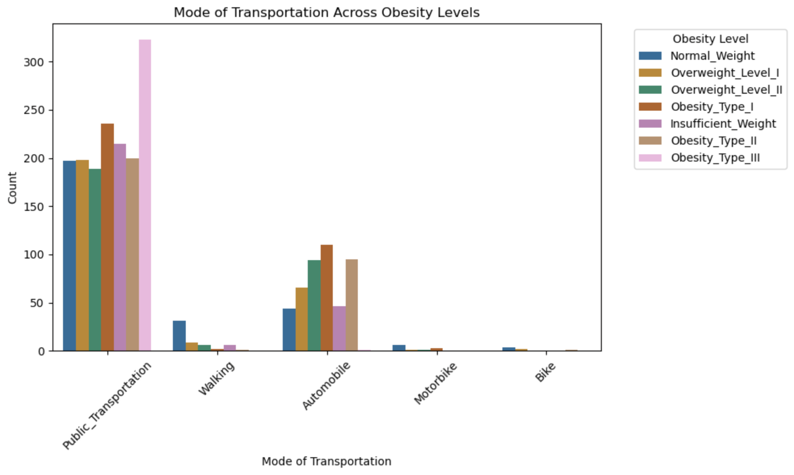

 

---

# 🩺 **Obesity Levels Based on Eating Habits & Physical Condition** 🔬

---

## 📑 Table of Contents

- [Team Members](#team-members)
- [Project Overview](#project-overview)
- [Introduction](#introduction)
- [Problem Statement](#problem-statement)
- [Business Goal](#business-goal)
- [Expected Benefits](#expected-benefits)
- [Data Science Approach](#data-science-approach)
- [Model Objectives](#model-objectives)
- [Methodology](#methodology)
- [Requirements](#requirements)
- [Data Overview](#data-overview)
- [Cleaning the Data](#cleaning-the-data)
- [Proposed Solution](#proposed-solution)
- [Insights and Visualizations](#insights-and-visualizations)
- [Implementation](#implementation)
- [Next Steps](#next-steps)
- [Risks and Mitigations](#risks-and-mitigations)
- [Results](#results)
- [Conclusion](#conclusion)

---

# **Team Members**
 
🧮 **Bitewulign Mekonnen** https://github.com/bitewulign/ 
📈 **Gulrukh Aqeel** http://linkedin.com/in/gulrukhaqeel/ 
📊 **Kate Antonova** https://www.linkedin.com/in/kate-antonova/ 
🗂️ **Richard Harkness** https://www.linkedin.com/in/rharkness/ 
📉 **Yalda Rahmati** https://www.linkedin.com/in/yalda-rahmati-/ 

---

# 📝**Project Overview**

As part of the Data Science Certificate program at the University of Toronto’s Data Sciences Institute, we selected the Estimation of Obesity Levels Based on Eating Habits and Physical Condition dataset and conducted a compelling study on which lifestyle factors have the greatest impact on obesity levels, applying the analytical and technical skills we developed throughout the course.
This study offers practical advice for public health authorities, health and wellness providers, and insurers looking to address obesity-related risks.
This business case proposes using a validated dataset and analytical models to accurately estimate and predict obesity levels based on eating habits, physical conditions and other factors. 

---

# 📚**Introduction**

Obesity is an escalating global health issue that significantly contributes to a range of chronic diseases, including heart disease, diabetes, and certain cancers. It is also associated with reduced life expectancy and leads to increased healthcare expenditures due to the need for long-term management of obesity-related conditions. Addressing this issue is crucial for improving public health outcomes and reducing the economic burden on healthcare systems. 

This business case delves into the promising application of the dataset titled "Estimation of Obesity Levels Based on Eating Habits and Physical Condition." By utilizing this comprehensive dataset, we aim to develop sophisticated predictive models that can accurately estimate obesity levels based on individuals' eating habits and physical conditions. These models will provide valuable insights to inform public health strategies and initiatives. 

With the integration of data analytics, we can enhance the effectiveness of public health campaigns by targeting specific populations at risk of obesity and tailoring interventions accordingly. Furthermore, this dataset can be leveraged to personalize health interventions, offering customized recommendations and support to individuals striving to achieve and maintain a healthy weight. 
Our primary objective is to harness the power of data to improve the prediction and prevention of obesity. By doing so, we hope to foster a healthier society, extend life expectancy, and alleviate the financial strain on healthcare systems worldwide.

---

# 🚨**Problem Statement**
 
Obesity affects millions worldwide, raising healthcare costs, reducing productivity, and increasing the risk of chronic diseases like diabetes and heart disease. Traditional methods, like self-reports and BMI, often miss key factors. A data-driven approach that considers eating habits, physical activity, and lifestyle offers a clearer picture. Early identification of risks can help individuals and organizations take proactive steps to improve health outcomes.

---

# 🏆**Business Goal**

🚀 **Key Insight:**  What are the key lifestyle factors (e.g., eating habits, physical activity) that contribute most to obesity levels?

We aim to use data science to build a predictive model that estimates obesity levels based on eating habits and physical health. This kind of model can help healthcare providers, fitness companies, insurance firms, and policymakers take more targeted action when it comes to preventing obesity.

---

# 🎯**Expected Benefits**
 
It helps with the early detection of obesity risks, allowing for timely interventions that can reduce long-term healthcare costs. Insurance companies and corporate wellness programs can use it to categorize policyholders or employees by risk level, making health initiatives more targeted and effective. Healthcare providers can support preventive care and deliver personalized treatments, while governments and policymakers gain evidence-based insights to guide public health campaigns and shape policy. In the fitness and wellness space, it enhances personalized health plans, and for individuals, it provides valuable insights to make informed decisions about their health and lifestyle.

---

# 🤖**Data Science Approach**
 
We are adopting a structured Data Science Approach (DSA) to explore key lifestyle and demographic factors associated with obesity. The following outlines our initial plan, which will evolve as we continue to refine our methods and results.

  
📌 <em>CLICK HERE TO READ MORE</em> 📌

 
### 🔎 Problem Understanding
We are in the process of clearly defining the problem, which focuses on predicting and analyzing obesity levels based on lifestyle behaviors and demographic factors. As we progress, we will continue to refine our understanding and focus areas.

### 🎯 Business Goal
Our intended goal is to help wellness providers and organizations identify the most influential factors contributing to obesity. This will guide them in designing effective health interventions and personalized wellness programs. We will revisit and adjust these goals as we uncover insights.

### 📂 Data Collection and Overview
We plan to use a widely recognized dataset from the UC Irvine Machine Learning Repository. The dataset includes synthetic data, designed to reflect real-world obesity trends while maintaining privacy. Our current focus is on understanding its structure, and we anticipate making further adjustments to how we preprocess and use the data.

### 🧹 Data Cleaning and Preparation
We have cleaning and prepared the dataset by handling missing values, and normalizing numerical features. This cleaning may evolve as we explore different preprocessing techniques and adapt our approach to improve model performance.

### 🏗️ Modeling Approach and Objectives
We intend to implement learning models, with an initial focus to predict obesity levels and analyze feature importance. These modeling choices are subject to change as we experiment with different algorithms and evaluate their performance.

### 📊 Evaluation
We will evaluate our models using various metrics. Our evaluation strategy may be revised as we test different models and techniques to ensure robust and reliable outcomes.

### 🛠️ Implementation
Our plan includes deploying the final solution as a static dashboard, where users can explore obesity-related insights. The dashboard will be refined as we finalize our models and visualizations.

### 💡 Results and Conclusions
Our conclusions and recommendations will be developed as we complete our analysis.

---

# 🧬**Model Objectives**

🚀 The key objectives presented by this model are as follows:

- Utilize learning models to predict obesity levels based on lifestyle and eating habits. 
- Identify key risk factors contributing to obesity. 
- Provide insight for insurance and healthcare professionals, policymakers and fitness industries. 
- Develop an early warning system for individuals at a risk of obesity. 

---

# 📐**Methodology**
 
We preprocess the data by cleaning it, ensuring there are no missing values or duplicates. Then, we perform exploratory data analysis to understand feature distributions and their relationships with obesity levels. Finally, we visualize these relationships between categorical features and obesity levels to support the development of a dashboard.

---

# 📋**Requirements**

The following Python libraries are used in this project:

- **NumPy:** Numerical computing and array operations. 
- **Pandas:** Analyzing and extracting insights from data. 
- **Matplotlib:** Creating static, animated, and interactive plots. 
- **Seaborn:** Creating statistical data visualizations. 
- **Scikit-learn:** Library for machine learning and data analysis. 
- **Plotly & Dash:** Plotly for interactive visualizations; Dash builds interactive apps and dashboards. 
- **Altair:** A declarative statistical visualization library for Python. 

---

# 🗂️**Data Overview**

This dataset provides a comprehensive view of factors linked to obesity by combining demographic, behavioral, and health-related details. It captures key aspects such as age, gender, physical condition, and BMI classifications. It also tracks eating habits, including the consumption of high-calorie foods, vegetables, and alcohol, as well as meal frequency, snacking, water intake, and physical activity levels. This diverse range of attributes enables a detailed analysis of obesity-related factors.

  
📌 <em>CLICK HERE TO READ MORE</em> 📌

 
**Dataset Feature Description**

The dataset provides information on individuals' obesity levels based on a variety of lifestyle and health-related factors. Below is a list of the features included, along with brief descriptions:
 
- **Gender:** Male or Female. 
- **Age:** In years. 
- **Height:** In meters. 
- **Weight:** In kilograms. 
- **Family_history_with_overweight:** Family history of being overweight (yes/no). 
- **FAVC (Frequent Consumption of High-Calorie Food):** Frequently eats high-calorie food (yes/no). 
- **FCVC (Frequency of Vegetable Consumption):** Scale from 1 (low) to 3 (high), indicating how often vegetables are consumed. 
- **NCP (Number of Meals Per Day):** Number of main meals the person eats each day. 
- **CAEC (Consumption of Food Between Meals):** How often the person eats snacks: no, sometimes, frequently, or always. 
- **SMOKE:** Individual smokes (yes/no). 
- **CH2O (Daily Water Intake in Liters):** Scale from 1 (low) to 3 (high), representing daily water consumption. 
- **SCC (Calories Consumption Monitoring):** Individuals monitor their calorie intake (yes/no). 
- **FAF (Physical Activity Frequency Per Week):** Scale from 0 (no activity) to 3 (high frequency). 
- **TUE (Time Using Technology Devices Per Day):** Scale from 0 (low) to 2 (high), measuring daily screen time. 
- **CALC (Alcohol Consumption Frequency):** How often alcohol is consumed: no, sometimes, frequently, or always. 
- **MTRANS (Mode of Transportation):** Main mode of transport: public transportation, walking, automobile, or motorbike. 
- **NObeyesdad (Obesity Level Classification):** The individual's obesity category: Insufficient Weight, Normal Weight, Overweight Level I, Overweight Level II, Obesity Type I, Obesity Type II, or Obesity Type III. 

---

# 🧼**Cleaning the Data**

The original dataset is of good quality with no missing values. However, it contained 24 duplicate rows, likely from synthetic generation (77% via Weka and SMOTE). We removed these duplicates, retaining unique entries, to improve reliability while preserving completeness.

---

# ⛑️**Proposed Solution**
 
The proposed solution uses the “Dataset for estimation of obesity levels based on eating habits and physical condition” to include visualizations to highlight the key factors that contribute most to obesity and develop a predictive model that classifies individuals into seven obesity levels. The process after data cleaning and preprocessing, identifys key factors such as diet quality, hydration, physical activity, sedentary behavior, and transport choices. The final step is creating an interactive tool or dashboard that delivers personalized health recommendations, targeted interventions, and easy monitoring for healthcare providers, fitness professionals, insurance companies, and policymakers.

---

# 🎨**Insights and Visualizations**
⚠️ **Note:** This dataset includes synthetically generated data based on real-world patterns. 

---

### Top 10 Important Features in Predicting Obesity Level

  
📌 <em>CLICK HERE TO READ MORE</em> 📌

This bar chart visualizes the top 10 most important features that influence obesity level prediction. The importance score represents the contribution of each feature to the model. Understanding these features helps in identifying key factors contributing to obesity and designing better intervention strategies!

Key Observations:
Weight is the most significant factor in determining obesity.
Age, Food Consumption (FCVC), and Height also play notable roles.
Gender is an important factor but not as influential as physical attributes like weight and height.
Physical activity (FAF) and water intake (CH2O) have moderate influence.
Visualization Details:
The y-axis lists the feature names, and the x-axis represents their importance score.
The chart is sorted in descending order, highlighting the most influential features at the top.

---

### Obesity Levels by Gender

  
📌 <em>CLICK HERE TO READ MORE</em> 📌

This grouped bar chart illustrates the distribution of obesity levels among males and females, making it easy to compare how each gender is represented across different obesity categories. The visualization addresses whether there are significant differences in obesity prevalence between men and women. It reveals that males are more frequently represented in the more severe obesity categories, while females tend to appear more often in the normal weight and lower obesity levels. These insights can inform wellness programs and support the development of gender-specific health interventions.

---

### Obesity Levels by Age Group and Gender

  
📌 <em>CLICK HERE TO READ MORE</em> 📌

 
This packed circle chart, created using Altair, visualizes the most common obesity levels across different age groups and genders. Each circle represents a specific demographic segment, where the size of the circle indicates the number of individuals within that group. The x-axis displays the age groups (16-25, 26-35, etc.), while the y-axis shows the corresponding count of individuals in each category. The color of each circle differentiates between obesity levels for easy comparison. This visualization helps wellness providers quickly identify high-risk groups and demographic patterns. By understanding which age and gender groups are more affected by obesity, providers can design more targeted wellness initiatives and health interventions to promote healthier habits and reduce obesity rates.

---

### Demographic Features vs. Obesity Level

  
📌 <em>CLICK HERE TO READ MORE</em> 📌

 
This visualization explores the relationship between demographic features (age and gender) and obesity levels. It consists of two plots:
- **Age** Distribution Across Obesity Levels (Boxplot)
- **Gender** Distribution Across Obesity Levels (Stacked Bar Chart)

## Age Distribution Across Obesity Levels
- The top plot is a **boxplot** showing the age distribution across different obesity levels.
- Each box represents the interquartile range (IQR), with whiskers extending to show variability outside the upper and lower quartiles.
- Outliers are marked as individual points.

### Key Observations:
The median age varies across different obesity levels, indicating how different weight categories are distributed across age groups.
- **Insufficient_Weight** : Individuals in this category tend to be younger, with the median age around 20 years. There are some outliers who are older, but the majority fall between 18-25 years old.
- **Normal_Weight**: Slightly broader distribution than the underweight group, but still concentrated in younger ages.
- **Overweight (Level I & II)**: A wider age range is observed, with more individuals in their mid-20s to early 30s.Overweight Level II shows a more spread-out age range, indicating that weight gain happens at different ages.
- **Obesity (Type I, II, III)**: The median age for Obesity Type I and II is around 30 years, with some individuals reaching their late 30s and early 40s.Obesity Type III (Severe Obesity) has the widest age range, spanning from early 20s to over 50 years old.This suggests that severe obesity is seen across different age groups, but younger individuals are also at risk.The presence of outliers at older ages indicates that obesity persists into later life stages for some individuals.

#### Implication: 
Obesity is more prevalent in older age groups, but younger individuals are also affected.
The higher the obesity level, the more spread-out the age distribution, suggesting different risk factors at different ages.

## Gender Distribution Across Obesity Levels
- The bottom plot is a **stacked bar chart** that visualizes gender distribution for each obesity category.
- It allows comparison of obesity levels between **male** and **female** participants.
### Key Observations:
- **Males** tend to be more prevalent in severe obesity levels, while **females** are more evenly distributed.
- **Insufficient_Weight & Normal_Weigh**: These categories have a relatively balanced gender distribution, though females slightly outnumber males.
- **Overweight (Level I & II)**: More males than females appear in these categories, suggesting that men are more likely to be overweight.
- **Obesity (Type I, II, III)**: The proportion of males increases significantly in severe obesity levels.Obesity Type III (Most Severe) has the highest number of males, indicating a potential gender-related difference in obesity trends.
 ### Implication: 
- Men tend to have a higher prevalence of obesity than women, especially in severe obesity categories.
 - Women are more evenly distributed across weight categories, while men are more concentrated in overweight and obesity levels.
- Gender differences in obesity may be linked to lifestyle, metabolism, or other health factors.
#### Overall Summary
- Younger individuals are more likely to be underweight or normal weight.
- Middle-aged individuals show the highest prevalence of obesity, with a broad range of ages affected.
- Males are more affected by severe obesity, while females have a more balanced distribution.

---

### Age vs Weight by Obesity Level

  
📌 <em>CLICK HERE TO READ MORE</em> 📌

 
This scatter plot, created using Plotly Express, visualizes the relationship between age and weight, with points color-coded by obesity levels and sized by height. The X-axis represents age, and the Y-axis shows weight, making it easy to interpret patterns at a glance. This visualization helps stakeholders identify high-risk groups, such as individuals over 40 with weights exceeding 80kg, who are more likely to fall into higher obesity categories. The insights can guide wellness providers and healthcare professionals in developing targeted, age-specific interventions to address obesity risks effectively.

---

### Height vs Weight Regression by Obesity Level

  
📌 <em>CLICK HERE TO READ MORE</em> 📌

 

 
This regression plot illustrates the relationship between height and weight across different obesity categories. Each obesity level is represented with a separate trend line, making it easy to compare how weight typically changes with height depending on the obesity classification. The plot reveals that individuals in higher obesity categories generally have higher weights for a given height compared to those in lower categories. This highlights weight as a key factor in distinguishing between obesity levels. The visualization, styled with an accessible color palette, helps to clearly demonstrate how physical measurements like height and weight interact in relation to obesity severity, providing valuable insights for health assessments and targeted interventions.

---

### Mode of Transportation Across Obesity Levels

  
📌 <em>CLICK HERE TO READ MORE</em> 📌

 
This grouped bar chart visualizes the relationship between transportation choices and obesity levels. It compares how frequently individuals in different obesity categories use various modes of transport, such as walking, public transportation, motorbike, and car. The chart reveals that individuals who walk or use public transportation tend to be in lower obesity categories, suggesting they may lead more active lifestyles. In contrast, those who primarily rely on cars or motorbikes are more frequently classified in higher obesity levels. This insight highlights the potential health benefits of promoting active commuting options to reduce obesity risks.

---

### Obesity by Food Between Meals

  
📌 <em>CLICK HERE TO READ MORE</em> 📌

This bar chart shows obesity levels segmented by the frequency of food consumption between meals. The x-axis represents different categories of food consumption between meals, while the y-axis represents the percentage of individuals within each obesity level. The bars are stacked - which is indicating proportion of each obesity level for each category of food consumption.

---

### Physical Activity Frequency Across Obesity Levels

  
📌 <em>CLICK HERE TO READ MORE</em> 📌

 

  
This radar plot displays the normalized average physical activity frequency per week across different obesity categories using a circular spider layout. The distance from the center represents activity levels, scaled as a percentage of the most active group (100%). Groups closer to the center indicate lower activity, often corresponding to higher obesity severity. This visualization highlights the inverse relationship between physical activity and obesity severity, showing that individuals in higher obesity categories typically engage in less physical activity. These insights emphasize the importance of promoting physical activity to reduce obesity risk and improve health outcomes. For insurance companies, understanding these patterns can inform risk assessments, guide premium calculations, and support the development of targeted wellness programs aimed at reducing long-term healthcare costs. The plot was created using a radar (spider) chart with Matplotlib’s polar plot functionality.

---

### Distributions by Obesity Level

The following image presents a series of box plots illustrating various distributions by obesity level. Each plot compares different metrics across categories such as Normal Weight, Overweight Levels I and II, and Obesity Types I, II, and III.

  
📌 <em>CLICK HERE TO READ MORE</em> 📌

 

- **Age Distribution:** Shows how age varies across obesity levels, with a wider range in higher obesity categories.
- **Height Distribution:** Displays height differences, with slight variations across categories.
- **Weight Distribution:** Clearly indicates increasing weight with higher obesity levels.
- **FCVC (Frequency of Consumption Vegetables):** Examines vegetable consumption frequency, showing similar medians across categories.
- **NCP (Number of Meals Per Day):** Highlights the number of main meals, with some variation in higher obesity levels.
- **CH2O (Daily Water Intake in Liters):** Shows water consumption, with a consistent median across categories.
- **FAF (Physical Activity Frequency Per Week):** Displays physical activity frequency, with slight decreases in higher obesity levels.
- **TUE (Time Using Technology Devices Per Day):** Illustrates technology usage time, with a slight increase in higher obesity levels.

Overall, these plots provide insights into how various factors correlate with different obesity levels.

---

### Various Factors by Obesity Level

The next image presents a series of bar charts analyzing various factors by obesity level. Each chart provides insights into how different variables correlate with obesity.

  
📌 <em>CLICK HERE TO READ MORE</em> 📌

 

**Gender Distribution**

- **Observation:** Both genders show a similar distribution across obesity levels, with a slight increase in higher obesity levels for males.
- **Insight:** Gender alone may not be a strong predictor of obesity, but there are subtle differences worth exploring further.

**Family History with Overweight**
- **Observation:** Individuals with a family history of being overweight are more prevalent in higher obesity categories.
- **Insight:** Genetic or familial factors may play a significant role in obesity risk.

**Frequency of Eating Vegetables (FAVC)**
- **Observation:** Those who do not frequently consume vegetables tend to have higher obesity levels.
- **Insight:** Diet, particularly vegetable intake, appears to be linked to obesity, highlighting the importance of dietary habits.

**Consumption of High-Calorie Food (CAEC)**
- **Observation:** Higher consumption of high-calorie foods correlates with increased obesity levels.
- **Insight:** Frequent consumption of high-calorie foods is a strong indicator of higher obesity levels.

**Smoking Habits (SMOKE)**
- **Observation:** Smoking does not show a strong correlation with obesity levels.
-  **Insight:** Smoking may not be a significant factor in determining obesity, though it has other health implications.

**Caloric Sweet Consumption (SCC)**
- **Observation:** Higher consumption of caloric sweets is associated with higher obesity levels.
- **Insight:** Reducing caloric sweet intake could be beneficial in managing obesity.

**Alcohol Consumption (CALC)**
- **Observation:** Frequent alcohol consumption is more common in higher obesity levels.
- **Insight:** Alcohol intake may contribute to obesity, suggesting moderation could be beneficial.

**Mode of Transportation (MTRANS)**
- **Observation:** Individuals using public transportation or walking tend to have lower obesity levels compared to those using automobiles.
- **Insight:** Active transportation methods like walking may help in maintaining a healthier weight.
Overall Analysis

These charts collectively highlight the multifaceted nature of obesity, influenced by dietary habits, family history, and lifestyle choices. Addressing these factors holistically could be key in managing and preventing obesity.

---

### Interactive Pie Charts Showing Obesity Distribution by Feature and Category

[Click Here for Interactive Pie Chart](https://obesity-dashboard-live-2.onrender.com/)
This interactive Pie Chart visually represents obesity distribution across different features for every feature and category. Using Plotly, the visualization allows users to explore proportions dynamically, with hover effects displaying detailed information for each segment.

  
📌 <em>CLICK HERE TO READ MORE</em> 📌

 

interpretion of cat bar plots vs Nobeysdad: 
- Gender does not seem to have a drastic impact, but males may be slightly more prone to higher obesity levels.
- There is a strong correlation between family history and obesity, indicating genetic or lifestyle factors play a role.
- Frequent consumption of high-caloric food strongly contributes to obesity.
- Frequent snacking (Always) does not necessarily increase the proportion of Obesity Type III.However, snacking "Sometimes" has a high proportion of severe obesity. So it seems occasional snacking might be riskier than always snacking, possibly due to uncontrolled eating patterns.
- Smokers and non-smokers have a similar distribution of obesity levels. So smoking habits in this dataset do not significantly impact obesity.
- Monitoring calorie intake may contribute to maintaining a healthier weight and reducing extreme obesity cases.However, some individuals who track calories still experience obesity, suggesting that monitoring alone is not always sufficient. Other factors (like physical activity, metabolism, and food quality) also play a role.
-  Alcohol consumption may influence obesity but is not the sole factor.
- Walking is associated with lower extreme obesity (Type III), but Public Transportation users still have significant obesity cases. People using public transport may still have a sedentary lifestyle, contributing to obesity. Automobile users might be at risk due to a more sedentary routine, but they are not the only ones with high obesity levels. So Transportation mode alone may not determine obesity—other lifestyle factors (e.g., diet, physical activity) are crucial.

---

# ⚙️**Implementation**

The implementation starts with applying data analytics techniques to the dataset to build an accurate and reliable model. Once the model is ready, the next step is to make it easy for health professionals and organizations to assess and manage obesity risk. The goal is to keep it simple and intuitive so users can quickly get the insights they need.

---

# 🪜**Next Steps**
 
The next steps start with running exploratory data analysis to get a better understanding of how different variables are connected. After that, the focus will be on training and validating the predictive models to make sure they’re accurate and reliable. Once the model is solid. The plan is to provide stakeholders, including health professionals and the public, with clear insights and visualizations through a comprehensive README on GitHub. This will include key information, data interpretations, and graphs to help them better understand and address obesity risks.

---

# 🚧**Risks and Mitigations**
 
There are a few risks to consider, but each has a clear plan to address them. First is data quality, if the data is incomplete or inaccurate, it can lead to unreliable results. To avoid this, the data will go through rigorous cleaning and validation to ensure it’s consistent and accurate before analysis. Another risk is bias in the analysis, which can happen if the dataset isn’t diverse enough. To minimize this, the data will be carefully reviewed to make sure it includes a wide range of demographic and lifestyle factors, helping to produce fair and balanced insights. Privacy is also a major concern, especially when dealing with health-related data. To protect personal information, the project will follow strict data protection regulations and best practices, ensuring all data remains confidential and secure throughout the process.

---

# 🏁**Results**

The model aims to create a positive impact and raise awareness across several key sectors. In healthcare, it supports preventive measures and enables more targeted interventions. For governments and policymakers, it offers evidence-based insights to guide public health initiatives and inform policy decisions. Individuals also benefit by gaining valuable knowledge that empowers them to make informed lifestyle choices and take control of their health.

---
# Machine learning results

-  #### Title: Predicting Obesity Levels Using Random Forest and Support Vector Machine Learning Models Based on Physical Activity and Dietary Habits

In this project, alongside data visualization and exploratory analysis, machine learning models are employed to predict obesity levels using data related to physical activity and dietary habits. The process involves several key steps: data preprocessing, model training, evaluation, and visualization of results through confusion matrix plots and ROC curves.

**Data Preprocessing:** As previously discussed, the dataset, containing features related to physical activity and dietary habits, is  cleaned and prepared. Features are categorized into numeric and categorical types. Numeric features are standardized using StandardScaler, while categorical features are encoded using OneHotEncoder. This preprocessing ensures that the data is in a suitable format for model training.

**Model Training:** Two machine learning models, **Random Forest and Support Vector Machine (SVM)**, are trained using the preprocessed data. The dataset is split into training (80%) and testing (20%) sets. Each model is trained on the training set, and predictions are made on the test set.

**Evaluation:** The models are evaluated using various metrics, including accuracy, precision, recall, and F1 score. These metrics provide a quantitative measure of the models' performance in predicting obesity levels. The results are as follows:
 

**Table 1:** model's performance metrics results
|                 | Accuracy | precision | recall   | f1_score |
|-----------------|----------|-----------|----------|----------|
| Random Forest   | 0.945    |  0.948    |  0.945   |  0.946   |
| Support Vector  | 0.914    |    0.916  |  0.914   |  0.914   |

- **Insights:**
   - Both models demonstrate strong performance across all metrics, with the Random Forest model slightly outperforming the SVM model in each category.
   - While both models perform well, further tuning and feature engineering could potentially enhance both models especially the SVM model's performance to match or exceed that of the Random Forest model.

**Confusion Matrix Plots:** Confusion matrices are plotted for both models to visualize the distribution of true positives, false positives, true negatives, and false negatives. These plots help identify specific areas where the models perform well or struggle, such as misclassifying certain obesity levels.

**Overall Analysis of the confusion matrix plots:**
- Both models show strong performance in correctly classifying most instances, particularly for Classes.
- The Random Forest model generally has fewer misclassifications compared to the SVM model, indicating slightly better performance.

**ROC Curve Analysis:** The Receiver Operating Characteristic (ROC) curves are generated for each class in a multi-class setting. By binarizing the labels, the ROC curves and Area Under the Curve (AUC) scores are computed for each class and a macro-average. These curves provide a visual representation of the models' ability to distinguish between different obesity levels, highlighting their discriminative power. 

**Overall Analysis of the ROC curve plot:**
- Both models exhibit strong performance, with Random Forest slightly outperforming SVM in terms of macro-average AUC.
- The models perform exceptionally well in distinguishing certain classes, such as Obesity_Type_I and Insufficient_Weight, but face challenges with others like Overweight_Level_I and Obesity_Type_II.
---

# 💡**Conclusion**

By using this dataset to estimate obesity levels, we can support smarter, data-driven decisions in healthcare, wellness, insurance, and public policy. The insights gained from the analysis not only have the potential to lower obesity rates but also to reduce long-term healthcare costs and improve overall productivity. Clear visualizations and accessible information empower stakeholders, from healthcare providers and insurance professionals to policymakers and individuals, to take proactive steps toward prevention and intervention. Ultimately, this approach promotes healthier lifestyles, supports early risk detection, and contributes to better public health outcomes on a larger scale.

In addition, this project demonstrates the application of machine learning models to predict obesity levels based on physical  activity and dietary habits data. The use of confusion matrices and ROC curves offers valuable insights into model performance, guiding further improvements and decision-making in health-related predictive analytics.

---
